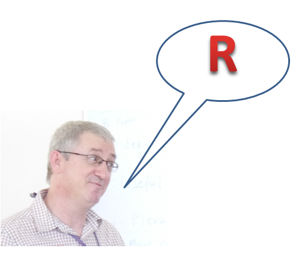
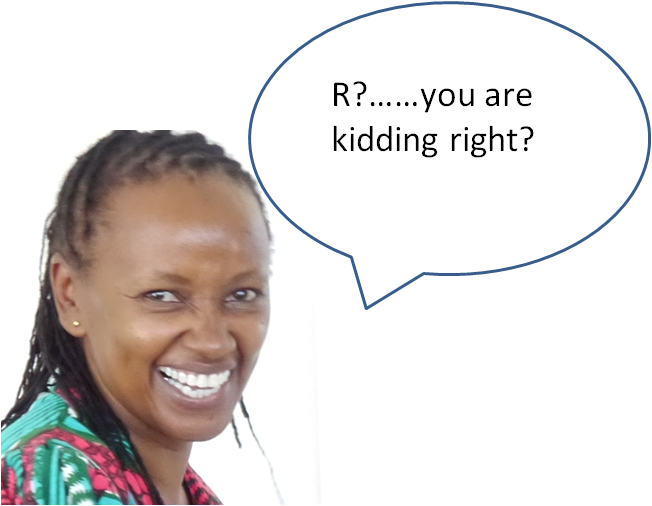
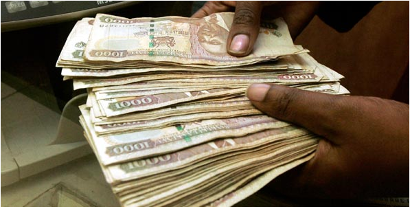
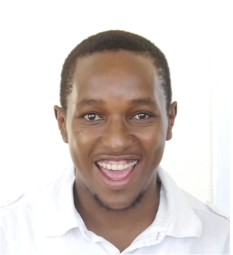
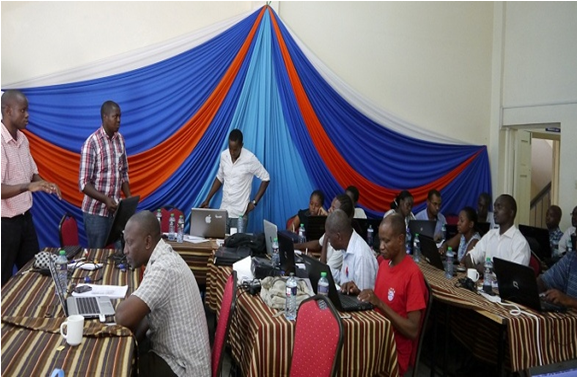
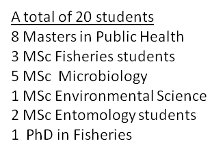
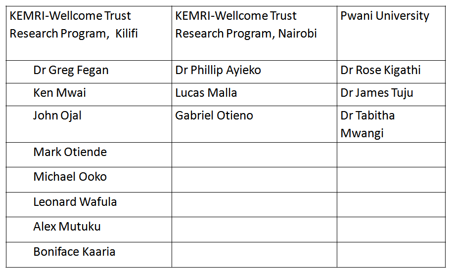
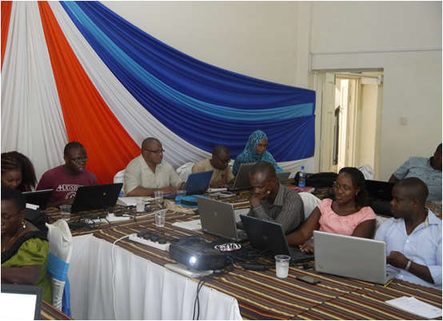
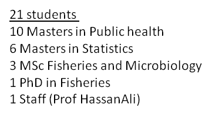
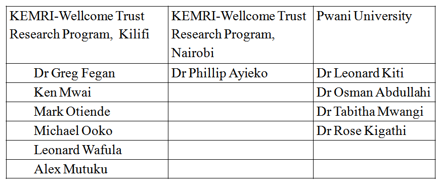

##I needed STATs software for my students
-For my training
    - STATA (phD)
    - Epi Info (Msc)    
-For the 1st MPH group Dr Osman taught Epi Info but we felt we needed a more robust software
-So I went to my STATs guru 
    - What is the way forward
    
##

##

## HE PUT IT IN A LANGUAGE THAT I UNDERSTAND

##What is the cost of software
-STATA
    - They don't even show you the price - you actually have to log in and fill a form to get it
    - http://www.stata.com/order/lab-quote-request/
    - KEMRI-Wellcome trust program in Kilifi spend 2,000 US$ upgrading their STATA license 2014

-Anyone know the cost of SAS?

- The cost of SPSS?

## The cost of 'R'

          FREE
          
##

Who will Prof Rajab listen to and support?

## Ken Mwai
- Greg passed me to this young man who has been the backbone of the R-workshops we have hosted in Pwani University

##
First 'R' stats workshop for post-graduate students in SPAS
    10th - 21st February, 2014
    
##1st 'R' Workshop from 10th - 21st Feb, 2014
 

##1st 'R' Workshop from 10th - 21st Feb, 2014

##Lessons Learned (sorted)
- Too much time wasted downloading materials
    - Materials were put on a CD that was given to each student but this slowed the training
    - Pwani university server set up for this purpose

- Some students last did stats in high school
    - Students must be exposed to stats in class first

- Lack of uniformity with plethora of facilitators
    - Reduced number of facilitators
    - Put all presentations on markdown ahead of workshop
    
##
Second statistics workshop for post-graduate students in SPAS
    - 9th - 20th February, 2015

## 2nd  'R' Workshop from 9th - 20th Feb, 2015
 

##1st 'R' Workshop from 9th - 20th Feb, 2015

##We are getting better
- Students more confident -those who had not covered  the statistics course in class were not allowed to attend

- The days were shorter and a lot more was covered
    - no time wasted downloading material due to good network due to the local server

##Lessons learned (not sorted yet)
- Not able to cater for all student needs
    - Mainly targeted to public health students
    - Fisheries, Agriculture, animal science
    -'Trainer of trainers' workshops idea born

- A few students not attending all sessions
    - A fee (2,000/-) added to the second workshop did not solve the problem

- Inability to pay facilitators
    - All facilitators earn nothing 
    - Might be impossible to sustain
    - Idea of commercializing R workshop born 
    
##Why trainer of trainers workshops
- To cater for all specializations
    - Fisheries, Education, Economics, Social sciences, Physical sciences

- To enable a larger group of students to be introduced to 'R'
    - To enable 'R' to spread to both under-graduate and post-graduate students

- To enable Pwani University to stand independently of KEMRI in running workshops
    - To collaborate but not from a place of neediness
    - To build skills to enable R workshops to be run commercially from Pwani University 

