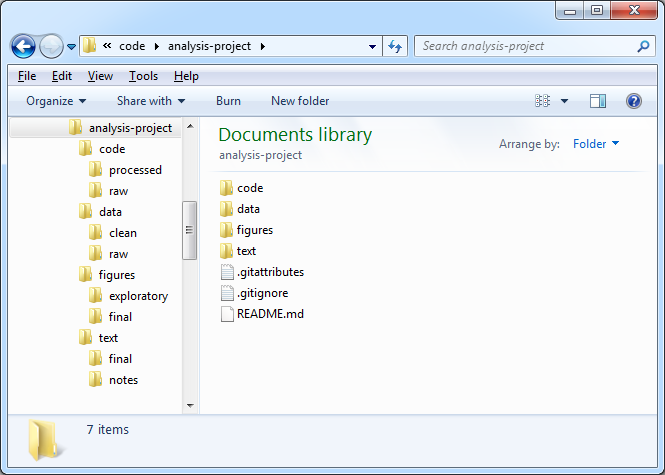
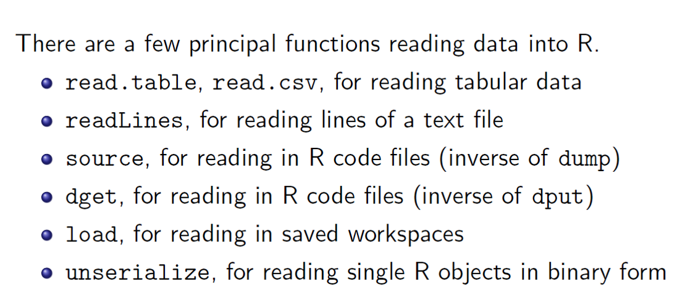

## R Markdown

This is an R Markdown presentation. Markdown is a simple formatting syntax for authoring HTML, PDF, and MS Word documents. For more details on using R Markdown see <http://rmarkdown.rstudio.com>.

When you click the **Knit** button a document will be generated that includes both content as well as the output of any embedded R code chunks within the document.

## Add a title - here Below are bulleted points

  - R is a dialect of the S language.
  - S is a language that was developed by John Chambers and others at Bell Labs. S was initiated in 1976
  - R was created in 1991 – by Rose Ihaka and Robert Gentleman
  - In 1993 R was released to the public. 1997: R core group was formed 2000: R 1.0.0 was released
  - We are using R version 3.1.2 (2014-10-31) 


## Add a title for a table

  
Data Types          | Stores                    | 
--------------------|---------------------------|
real                | floating point numbers    | 
integer             | integers                  |
complex             | Complex numbers           |
factor              | categorical data          | 
character           | strings                   | 
logical             | TRUE or FALSe             | 
NA                  | Missing                   |
NULL                | Empty                     |
Function            | Function type             | 
--------------------|------------------------------

## Add an image beloe


## Include an R Code 

- A vector can only contain objects of the same class

```{r }
a <- c(1,2,5.3,6,-2,4) # numeric vector
b <- c("one","two","three") # character vector
c <- c(TRUE,TRUE,TRUE,FALSE,TRUE,FALSE) #logical vector
```


## Include an Image again

 - Using R Studio to create a Project  - From an existing directory 
 

## Image again

- *Source: Computing for Data Analysis-Roger Peng*


## Mathematical Formula
$$
P(x>4) = 1-[P(x=0) + P(x=2) +P(x=2) +P(x=3) +P(x=4) ]
$$

$$X^2_{i,j}$$

$$\sum_{i=1}^{n}\left( \frac{X_i}{Y_i} \right)$$


## Greek letters

$$\alpha, \beta,  \gamma, \Gamma$$

  
## Special Functions

$$\int_0^{2\pi} \sin x~dx$$


## Useful Links

 - [RStudio Markdown](http://rmarkdown.rstudio.com/)
 - [Markdown Cheat Sheet](https://github.com/adam-p/markdown-here/wiki/Markdown-Cheatsheet)
 - [Chear Sheet Pdf](http://www.rstudio.com/wp-content/uploads/2015/02/rmarkdown-cheatsheet.pdf)
 - [Example](http://slidify.org/samples/intro/#7)
 - [Example](http://rpubs.com/keniajin/textpredict)
